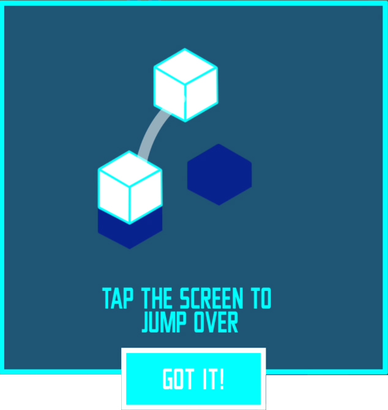
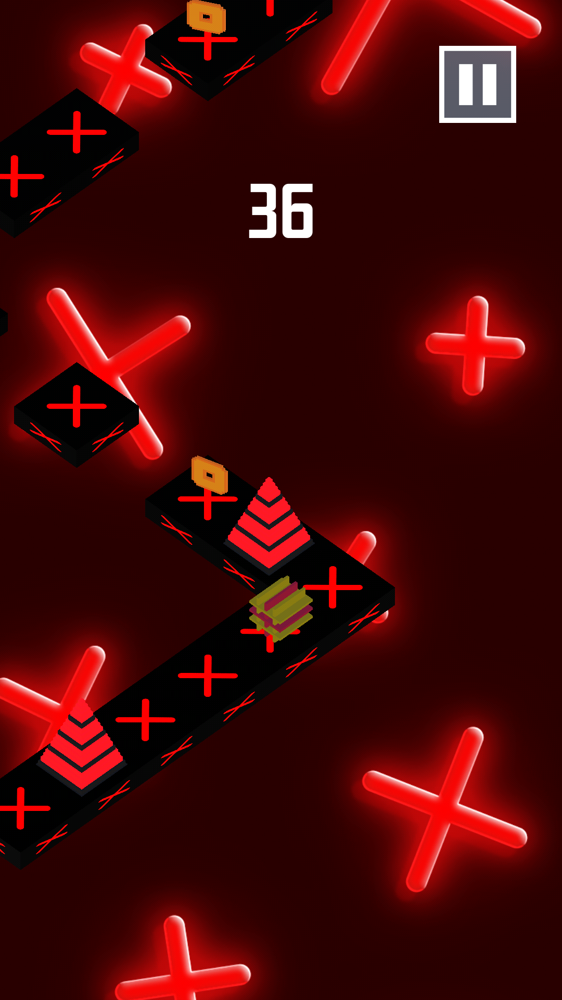
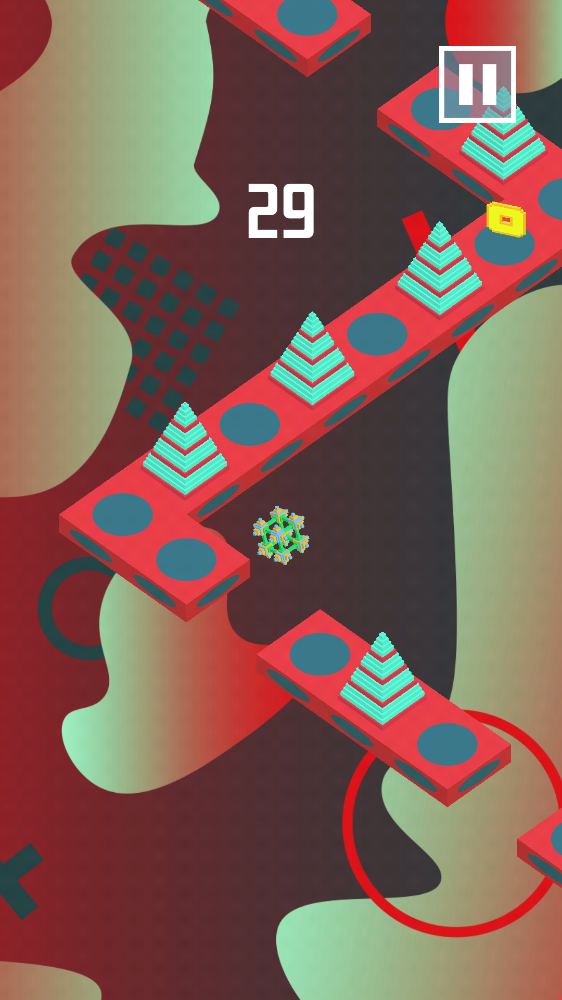
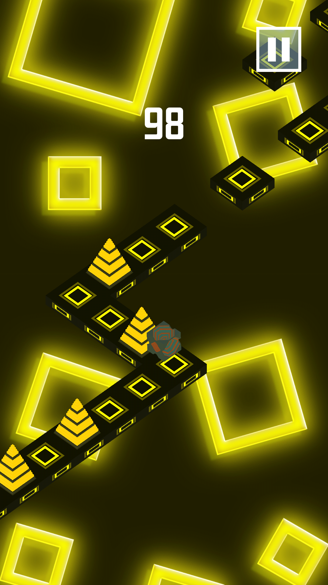

	
	<h2 align="center">CubeTrip</h2>

# О проекте

CubeTrip - гиперказуальная мобильная игра, разработанная на движке Unity для Android-устройств. 
В ней игроку необходимо управлять кубом, перепрыгивая препятствия и собирая монетки. 

Мной были разработаны все аспекты данной игры.

 <a href="https://www.youtube.com/watch?v=6XmX8QYWCLA&ab_channel=StarEngine">ПРОМО-ВИДЕО </a>

<table>
<tr>
	<td>
		
	</td>
	<td valign="top">
		
	</td>
</tr>
</table>

# Разработанные системы и механики
Помимо core-механики игры, также внедрены дополнительные механики получения монет и новых аксессуаров.

## Магазин
В магазине игрок может потратить заработанные монеты на покупку новых кубов или тем игры (тема меняет изображение фона и расцветку блоков).
<table>
<tr>
	<td>
		
	</td>
	<td>
		
	</td>
</tr>
</table>

Примеры:

<table>
<tr>
	<td>
		
	</td>
	<td>
		
	</td>
	<td>
		
	</td>
</tr>
</table>

## Квест-система
Система отслеживает достижения игрока, пополняя счетчик игровых очков, прыжков и т.д.

Можно пройти 25 "миссий", заработав различное кол-во монет.

## Колесо фортуны
Раскрутить колесо можно только после просмотра видео-рекламы. На демонстрационном ролике монетизация отключена.

Игрок может получить некоторое количество монет, новый куб или тему игры (фон и расцветку блоков).

## Периодический приз
Каждые 2 минуты можно открыть призовой "конверт" и получить 25 монет.

